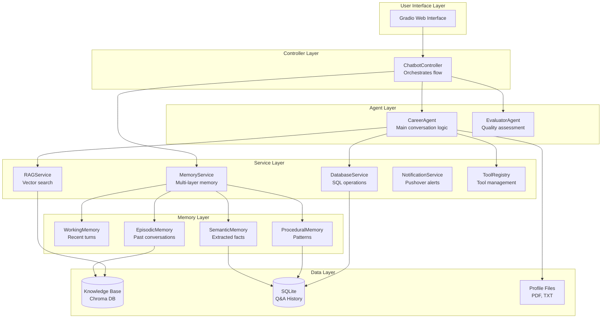
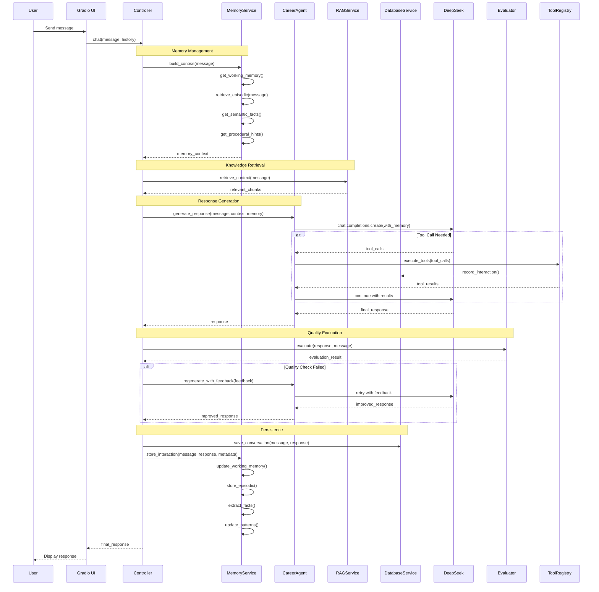

# ADR 001: Modular Architecture with RAG and Evaluator Pattern

**Status:** Proposed  
**Date:** 2025-10-26  
**Deciders:** Development Team  
**Technical Story:** Refactor monolithic career chatbot into production-ready agentic AI system

## Context and Problem Statement

The current `app_deepseek.py` implementation is a monolithic file with all logic in one place (~192 lines). While functional, it has several limitations:

- **Tight Coupling**: All components (LLM, notifications, file loading, prompts) are tightly coupled
- **Limited Extensibility**: Adding new tools or features requires modifying core logic
- **No Knowledge Base**: Relies only on static PDF/TXT files without semantic search
- **No Quality Control**: No evaluation mechanism for response quality
- **No Analytics**: No tracking of conversations, common questions, or user interactions
- **Testing Difficulty**: Monolithic structure makes unit testing challenging
- **Violates SRP**: Single class handles multiple responsibilities

**Goal:** Transform into a modular, production-ready system following clean code principles and agentic AI best practices.

## Decision Drivers

- **Maintainability**: Code should be easy to understand, modify, and extend
- **Testability**: Components should be independently testable
- **Scalability**: Architecture should support adding new features without major refactoring
- **Quality**: Implement quality control mechanisms for responses
- **Intelligence**: Add RAG for better context retrieval
- **Analytics**: Track usage patterns and improve over time
- **Best Practices**: Follow SOLID principles and agentic design patterns

## Considered Options

### Option 1: Keep Monolithic Structure (Status Quo)
- **Pros**: Simple, no refactoring needed, works for basic use cases
- **Cons**: Hard to maintain, test, and extend; no advanced features

### Option 2: Minimal Refactoring (Split into 3-4 files)
- **Pros**: Quick to implement, some separation of concerns
- **Cons**: Still limited extensibility, no proper architecture

### Option 3: Full Modular Architecture (Chosen)
- **Pros**: Clean separation, highly extensible, testable, production-ready
- **Cons**: More initial development time, more files to manage

## Decision Outcome

**Chosen Option:** Option 3 - Full Modular Architecture

Implement a layered architecture with clear separation of concerns:

```
User Interface → Controller → Agents → Services → Data Layer
```

### Architecture Overview



### Project Structure

```
career_chatbot_deepseek/
├── app.py                          # Entry point (Gradio)
├── requirements.txt                # Dependencies
├── .env.example                    # Environment template
├── .gitignore
│
├── config/
│   ├── __init__.py
│   └── settings.py                 # Configuration management (Pydantic Settings)
│
├── core/
│   ├── __init__.py
│   ├── agent.py                    # CareerAgent class
│   ├── evaluator.py                # EvaluatorAgent class
│   └── controller.py               # ChatbotController orchestrator
│
├── services/
│   ├── __init__.py
│   ├── rag_service.py              # RAG with Chroma vector DB
│   ├── database_service.py         # SQL operations (SQLAlchemy)
│   ├── notification_service.py     # Pushover integration
│   └── llm_service.py              # LLM client wrapper (DeepSeek)
│
├── memory/
│   ├── __init__.py
│   ├── memory_service.py           # MemoryService orchestrator
│   ├── working_memory.py           # WorkingMemory - recent conversation buffer
│   ├── episodic_memory.py          # EpisodicMemory - long-term retrieval
│   ├── semantic_memory.py          # SemanticMemory - fact extraction
│   └── procedural_memory.py        # ProceduralMemory - pattern learning
│
├── tools/
│   ├── __init__.py
│   ├── base.py                     # BaseTool abstract class
│   ├── registry.py                 # ToolRegistry for dynamic tool management
│   ├── contact_tool.py             # record_user_details
│   ├── question_tool.py            # record_unknown_question
│   └── search_tool.py              # search_qa_database
│
├── models/
│   ├── __init__.py
│   ├── schemas.py                  # Pydantic models (validation)
│   └── database.py                 # SQLAlchemy models (ORM)
│
├── utils/
│   ├── __init__.py
│   ├── prompt_builder.py           # System prompt construction
│   └── file_loader.py              # PDF/TXT loading utilities
│
├── knowledge_base/                 # Documents for RAG
│   ├── linkedin.pdf
│   ├── summary.txt
│   └── additional_docs/
│
├── data/
│   ├── career_qa.db                # SQLite database
│   └── chroma_db/                  # Vector store (Chroma)
│
├── adr/                            # Architecture Decision Records
│   └── 001-modular-architecture.md
│
└── tests/
    ├── __init__.py
    ├── test_agent.py
    ├── test_rag.py
    ├── test_tools.py
    └── test_controller.py
```

## Agentic Patterns Applied

### 1. 🔗 Prompt Chaining
**Pattern:** Sequential AI calls where outputs become inputs

**Implementation:**
```
User Query → RAG Retrieval → Agent Response → Evaluator Assessment
```

**Benefits:**
- Clear data flow
- Each stage specialized
- Easy to debug and optimize

### 2. 🔄 Reflection (Evaluator-Optimizer)
**Pattern:** Using AI to evaluate and improve AI outputs

**Implementation:**
- EvaluatorAgent assesses response quality
- If quality check fails, agent regenerates with feedback
- Iterative improvement loop

**Benefits:**
- Quality assurance built-in
- Self-improving system
- Reduces poor responses

### 3. 🛠️ Tool Use
**Pattern:** Dynamic tool calling for external actions

**Implementation:**
- OpenAI function calling
- Extensible tool registry
- Tools can access services (DB, notifications, etc.)

**Benefits:**
- Extensible without code changes
- LLM decides when to use tools
- Clean separation of concerns

### 4. 📊 Planning & Orchestration
**Pattern:** Controller manages workflow and decision-making

**Implementation:**
- ChatbotController orchestrates the flow
- Conditional evaluation (can be disabled)
- Context-aware decisions (RAG optional)

**Benefits:**
- Centralized control logic
- Easy to modify workflow
- Clear entry point

### 5. 🎯 Multi-Agent Collaboration
**Pattern:** Multiple specialized agents working together

**Implementation:**
- CareerAgent: Primary conversation
- EvaluatorAgent: Quality control
- Each with specific responsibility

**Benefits:**
- Separation of concerns
- Independent optimization
- Clear responsibilities

## Clean Code Principles Applied

### Single Responsibility Principle (SRP)
- **CareerAgent**: Only handles conversation generation
- **EvaluatorAgent**: Only evaluates quality
- **RAGService**: Only handles vector search
- **DatabaseService**: Only handles SQL operations
- **ToolRegistry**: Only manages tools

### Open/Closed Principle
- **Tools**: New tools can be added without modifying existing code
- **Services**: New services can be injected without changing agents
- **Extensible**: Plugin architecture for tools

### Dependency Inversion Principle
- **Dependency Injection**: Services injected into agents
- **Loose Coupling**: Agents depend on abstractions, not concrete implementations
- **Testability**: Easy to mock dependencies

### Interface Segregation Principle
- **Focused Interfaces**: Each component has minimal, focused interface
- **BaseTool**: Abstract class defines tool contract
- **No Fat Interfaces**: Components only expose what's needed

### Don't Repeat Yourself (DRY)
- **Shared Utilities**: Prompt builder, file loader
- **Reusable Services**: RAG, DB, notification services
- **Configuration**: Centralized in settings.py

## Technology Stack

| Component | Technology | Justification |
|-----------|-----------|---------------|
| **Primary LLM** | DeepSeek | Cost-effective ($0.14/$0.28 per M tokens), high quality |
| **Evaluator LLM** | Gemini 2.0 Flash | Fast, structured output support, good for evaluation |
| **Vector DB** | Chroma | Simple, embedded, no separate server needed |
| **SQL DB** | SQLite | Embedded, no setup, sufficient for analytics |
| **Embeddings** | sentence-transformers/all-MiniLM-L6-v2 | Fast, good quality, runs locally |
| **ORM** | SQLAlchemy | Industry standard, powerful, well-documented |
| **Validation** | Pydantic | Type safety, automatic validation, great DX |
| **Config** | pydantic-settings | Type-safe config, .env support |
| **Web UI** | Gradio | Quick to build, HuggingFace integration |
| **Text Splitting** | LangChain | Mature, well-tested chunking algorithms |

## Sequence Diagram



## Key Components

### 1. Configuration Management (`config/settings.py`)
**Responsibility:** Centralized configuration using Pydantic Settings

**Features:**
- Type-safe configuration
- .env file support
- Default values
- Validation

**Example:**
```python
class Settings(BaseSettings):
    deepseek_api_key: str
    primary_model: str = "deepseek-chat"
    enable_rag: bool = True
    enable_evaluation: bool = True
    chunk_size: int = 1000
    top_k_results: int = 3
```

### 2. RAG Service (`services/rag_service.py`)
**Responsibility:** Semantic search over knowledge base

**Features:**
- Document ingestion from knowledge_base/
- Chunking with overlap
- Vector embeddings
- Similarity search

**Key Methods:**
- `retrieve_context(query)`: Get relevant chunks
- `ingest_documents()`: Load and index documents
- `search_with_metadata()`: Debug retrieval

### 3. Database Service (`services/database_service.py`)
**Responsibility:** SQL operations for persistence and analytics

**Features:**
- Conversation history
- Contact management
- Unknown question tracking
- Analytics queries

**Tables:**
- `conversations`: Q&A pairs with evaluation scores
- `contacts`: User contact information
- `unknown_questions`: Questions that couldn't be answered

### 4. Tool Registry (`tools/registry.py`)
**Responsibility:** Dynamic tool management

**Features:**
- Register tools dynamically
- Generate OpenAI function schemas
- Execute tools by name
- Error handling

**Extensibility:**
```python
# Add new tool without modifying existing code
registry.register(NewTool())
```

### 5. Career Agent (`core/agent.py`)
**Responsibility:** Main conversation logic with tool calling

**Features:**
- RAG-augmented responses
- Tool calling loop
- Feedback incorporation
- Context management

### 6. Evaluator Agent (`core/evaluator.py`)
**Responsibility:** Quality assessment

**Features:**
- Structured evaluation (Pydantic)
- Scoring (1-10)
- Specific feedback
- Accept/reject decisions

### 7. Memory Service (`memory/memory_service.py`)
**Responsibility:** Multi-layer memory management following context engineering best practices

**Architecture:**
```python
class MemoryService:
    """Orchestrates four memory layers."""
    
    def __init__(
        self,
        working_memory: WorkingMemory,
        episodic_memory: EpisodicMemory,
        semantic_memory: SemanticMemory,
        procedural_memory: ProceduralMemory
    ):
        self.working = working_memory
        self.episodic = episodic_memory
        self.semantic = semantic_memory
        self.procedural = procedural_memory
```

**Memory Layers:**

#### 7.1 Working Memory (`memory/working_memory.py`)
**Responsibility:** Short-term conversation buffer (SRP)

**Features:**
- Maintains last N turns (default: 10)
- Token-aware trimming
- FIFO strategy
- Fast access (O(1))

**Implementation:**
```python
class WorkingMemory:
    """Recent conversation turns."""
    
    def __init__(self, max_turns: int = 10, max_tokens: int = 4000):
        self.max_turns = max_turns
        self.max_tokens = max_tokens
        self.messages: deque = deque(maxlen=max_turns * 2)
    
    def add_message(self, role: str, content: str):
        """Add message and auto-trim if needed."""
        self.messages.append({"role": role, "content": content})
        self._trim_if_exceeds_tokens()
    
    def get_messages(self) -> List[Dict]:
        """Get current working memory."""
        return list(self.messages)
```

**Clean Code Principles:**
- ✅ Single Responsibility: Only manages recent turns
- ✅ Encapsulation: Internal trimming logic hidden
- ✅ Simple interface: add_message(), get_messages()

#### 7.2 Episodic Memory (`memory/episodic_memory.py`)
**Responsibility:** Long-term conversation retrieval (SRP)

**Features:**
- Semantic search over past conversations
- Quality filtering (only retrieve high-scoring conversations)
- Recency weighting
- Deduplication

**Implementation:**
```python
class EpisodicMemory:
    """Semantic search over conversation history."""
    
    def __init__(self, vectorstore: Chroma, db_service: DatabaseService):
        self.vectorstore = vectorstore
        self.db = db_service
    
    def store_conversation(
        self,
        user_msg: str,
        assistant_msg: str,
        metadata: dict
    ):
        """Store conversation for future retrieval."""
        combined = f"User: {user_msg}\nAssistant: {assistant_msg}"
        self.vectorstore.add_texts(
            texts=[combined],
            metadatas=[{
                "user_msg": user_msg,
                "assistant_msg": assistant_msg,
                "score": metadata.get("evaluation_score"),
                "timestamp": metadata.get("timestamp")
            }]
        )
    
    def retrieve_relevant(
        self,
        query: str,
        top_k: int = 3,
        min_score: float = 7.0
    ) -> List[Dict]:
        """Retrieve relevant past conversations."""
        results = self.vectorstore.similarity_search(
            query,
            k=top_k,
            filter={"score": {"$gte": min_score}}
        )
        return [
            {
                "user": doc.metadata["user_msg"],
                "assistant": doc.metadata["assistant_msg"],
                "relevance": doc.metadata.get("score", 0)
            }
            for doc in results
        ]
```

**Clean Code Principles:**
- ✅ Single Responsibility: Only handles long-term retrieval
- ✅ Dependency Injection: Vectorstore and DB injected
- ✅ Clear naming: retrieve_relevant, store_conversation

#### 7.3 Semantic Memory (`memory/semantic_memory.py`)
**Responsibility:** Fact extraction and storage (SRP)

**Features:**
- LLM-based fact extraction
- Structured fact storage
- Confidence scoring
- Fact retrieval and summarization

**Implementation:**
```python
class SemanticMemory:
    """Extracted facts about user and conversation."""
    
    def __init__(
        self,
        db_service: DatabaseService,
        llm_service: LLMService
    ):
        self.db = db_service
        self.llm = llm_service
        self.facts: Dict[str, Any] = {}
    
    def extract_facts(self, conversation: List[Dict]) -> Dict[str, Any]:
        """Extract structured facts from conversation."""
        extraction_prompt = """
        Extract key facts from this conversation:
        - User's name, company, role
        - Specific interests mentioned
        - Questions asked
        - Action items
        
        Return as JSON with confidence scores.
        """
        
        facts = self.llm.extract_structured(
            conversation,
            extraction_prompt,
            response_format=FactExtraction
        )
        
        # Store facts
        for fact in facts:
            self.db.save_fact(fact)
            self.facts[fact.key] = fact.value
        
        return facts
    
    def get_facts_summary(self) -> str:
        """Get formatted summary of known facts."""
        if not self.facts:
            return ""
        
        summary = "## Known Facts:\n"
        for key, value in self.facts.items():
            summary += f"- {key}: {value}\n"
        return summary
```

**Clean Code Principles:**
- ✅ Single Responsibility: Only extracts and manages facts
- ✅ Separation of Concerns: Uses LLM service for extraction
- ✅ Type safety: Uses Pydantic models

#### 7.4 Procedural Memory (`memory/procedural_memory.py`)
**Responsibility:** Pattern learning and analytics (SRP)

**Features:**
- Interaction pattern analysis
- Preference learning
- Usage statistics
- Hints generation for LLM

**Implementation:**
```python
class ProceduralMemory:
    """Learn interaction patterns over time."""
    
    def __init__(self, db_service: DatabaseService):
        self.db = db_service
        self.patterns: Dict[str, Any] = {}
    
    def analyze_patterns(self) -> Dict[str, Any]:
        """Analyze conversation patterns from database."""
        analytics = self.db.get_analytics()
        
        patterns = {
            "common_questions": analytics["top_questions"][:5],
            "avg_conversation_length": analytics["avg_turns"],
            "preferred_response_style": self._infer_style(analytics),
            "topics_of_interest": analytics["topic_frequency"]
        }
        
        self.patterns = patterns
        return patterns
    
    def get_context_hints(self) -> str:
        """Provide hints to LLM based on learned patterns."""
        if not self.patterns:
            return ""
        
        hints = "## Interaction Patterns:\n"
        if self.patterns.get("preferred_response_style"):
            hints += f"- User prefers {self.patterns['preferred_response_style']} responses\n"
        
        return hints
    
    def _infer_style(self, analytics: Dict) -> str:
        """Infer preferred response style from analytics."""
        avg_length = analytics.get("avg_response_length", 0)
        if avg_length > 500:
            return "detailed"
        elif avg_length > 200:
            return "moderate"
        else:
            return "concise"
```

**Clean Code Principles:**
- ✅ Single Responsibility: Only analyzes patterns
- ✅ Private methods: _infer_style() for internal logic
- ✅ Clear naming: analyze_patterns, get_context_hints

**Memory Service Integration:**
```python
class MemoryService:
    """Orchestrates all memory layers."""
    
    def build_context(self, user_message: str) -> str:
        """Build complete memory context."""
        context_parts = []
        
        # 1. Semantic facts (always include)
        facts = self.semantic.get_facts_summary()
        if facts:
            context_parts.append(facts)
        
        # 2. Procedural hints
        hints = self.procedural.get_context_hints()
        if hints:
            context_parts.append(hints)
        
        # 3. Episodic memory (retrieve relevant)
        relevant = self.episodic.retrieve_relevant(user_message, top_k=2)
        if relevant:
            past_context = "## Relevant Past Conversations:\n"
            for i, conv in enumerate(relevant, 1):
                past_context += f"{i}. User: {conv['user']}\n"
                past_context += f"   You: {conv['assistant'][:100]}...\n\n"
            context_parts.append(past_context)
        
        return "\n\n".join(context_parts)
    
    def store_interaction(
        self,
        user_message: str,
        assistant_response: str,
        metadata: dict
    ):
        """Store interaction across all layers."""
        # Working memory (immediate)
        self.working.add_message("user", user_message)
        self.working.add_message("assistant", assistant_response)
        
        # Episodic memory (for retrieval)
        self.episodic.store_conversation(
            user_message,
            assistant_response,
            metadata
        )
        
        # Semantic memory (periodic extraction)
        if len(self.working.get_messages()) % 10 == 0:
            recent = self.working.get_messages()[-10:]
            self.semantic.extract_facts(recent)
        
        # Procedural memory (background update)
        # Updated asynchronously or periodically
```

**Context Engineering Best Practices:**
- ✅ **Layered approach**: Different memory types for different needs
- ✅ **Token budget**: Each layer has token limits
- ✅ **Relevance filtering**: Only include high-quality past conversations
- ✅ **Recency bias**: Recent conversations weighted higher
- ✅ **Semantic search**: Find relevant, not just recent
- ✅ **Fact extraction**: Compress information into facts
- ✅ **Pattern learning**: Adapt to user preferences

### 8. Controller (`core/controller.py`)
**Responsibility:** Orchestrate the agentic workflow

**Features:**
- Memory context building
- RAG retrieval
- Agent invocation
- Quality evaluation
- Retry logic
- Database persistence

**Integration with Memory:**
```python
class ChatbotController:
    """Main orchestrator."""
    
    def __init__(
        self,
        agent: CareerAgent,
        evaluator: EvaluatorAgent,
        memory_service: MemoryService,
        rag_service: RAGService,
        db_service: DatabaseService
    ):
        self.agent = agent
        self.evaluator = evaluator
        self.memory = memory_service
        self.rag = rag_service
        self.db = db_service
    
    def chat(self, message: str, history: List[Dict]) -> str:
        """Main chat workflow with memory."""
        # 1. Build memory context
        memory_context = self.memory.build_context(message)
        
        # 2. RAG retrieval
        rag_context = self.rag.retrieve_context(message) if settings.enable_rag else None
        
        # 3. Generate response
        response = self.agent.generate_response(
            message,
            history,
            rag_context=rag_context,
            memory_context=memory_context
        )
        
        # 4. Evaluate
        evaluation = None
        if settings.enable_evaluation:
            evaluation = self.evaluator.evaluate(response, message, history)
            if not evaluation.acceptable:
                response = self.agent.regenerate_with_feedback(
                    response, message, history, evaluation.feedback
                )
        
        # 5. Store in memory
        self.memory.store_interaction(
            message,
            response,
            {"evaluation_score": evaluation.score if evaluation else None}
        )
        
        # 6. Save to database
        self.db.save_conversation(message, response, evaluation)
        
        return response
```

**Clean Code Principles:**
- ✅ Single Responsibility: Only orchestrates, doesn't implement
- ✅ Dependency Injection: All services injected
- ✅ Open/Closed: Easy to add new services without modifying
- ✅ Clear flow: Step-by-step workflow

## Implementation Phases

### Phase 1: Foundation (Week 1)
**Goal:** Set up structure and core models

- [ ] Create directory structure (config/, core/, services/, memory/, tools/, models/, utils/)
- [ ] Implement `config/settings.py` with Pydantic Settings
- [ ] Create `models/schemas.py` (Pydantic models for validation)
  - Evaluation, ContactRecord, QARecord, ToolCall, FactExtraction
- [ ] Create `models/database.py` (SQLAlchemy ORM models)
  - Conversation, Contact, UnknownQuestion, SemanticFacts tables
- [ ] Implement `tools/base.py` (BaseTool abstract class)
- [ ] Implement `tools/registry.py` (ToolRegistry for dynamic management)
- [ ] Write unit tests for models and base classes
- [ ] Set up pytest configuration

**Deliverables:** Project skeleton, configuration system, data models

### Phase 2: Services (Week 2)
**Goal:** Build service layer

- [ ] Implement `services/llm_service.py` (DeepSeek client wrapper)
- [ ] Implement `services/database_service.py` (SQLAlchemy operations)
  - save_conversation(), save_contact(), get_analytics()
- [ ] Implement `services/rag_service.py` (Chroma vector DB)
  - ingest_documents(), retrieve_context()
- [ ] Implement `services/notification_service.py` (Pushover integration)
- [ ] Write unit tests for all services (with mocking)
- [ ] Integration tests for database operations

**Deliverables:** All services working independently

### Phase 3: Memory System (Week 3)
**Goal:** Build four-layer memory system

- [ ] Implement `memory/working_memory.py` (WorkingMemory class)
  - add_message(), get_messages(), token-aware trimming
- [ ] Implement `memory/episodic_memory.py` (EpisodicMemory class)
  - store_conversation(), retrieve_relevant() with quality filtering
- [ ] Implement `memory/semantic_memory.py` (SemanticMemory class)
  - extract_facts(), get_facts_summary(), confidence scoring
- [ ] Implement `memory/procedural_memory.py` (ProceduralMemory class)
  - analyze_patterns(), get_context_hints(), style inference
- [ ] Implement `memory/memory_service.py` (MemoryService orchestrator)
  - build_context(), store_interaction()
- [ ] Write unit tests for each memory layer
- [ ] Integration tests for memory service
- [ ] Test token budget management

**Deliverables:** Complete memory system following context engineering best practices

### Phase 4: Agents & Tools (Week 4)
**Goal:** Build agent layer and concrete tools

- [ ] Implement `utils/prompt_builder.py` (System prompt construction with textwrap.dedent)
- [ ] Implement `utils/file_loader.py` (PDF/TXT loading with caching)
- [ ] Implement `core/agent.py` (CareerAgent with tool calling)
  - generate_response(), regenerate_with_feedback()
  - Integration with MemoryService
- [ ] Implement `core/evaluator.py` (EvaluatorAgent with Gemini)
  - evaluate() with Pydantic structured output
- [ ] Create concrete tools:
  - `tools/contact_tool.py` (record_user_details)
  - `tools/question_tool.py` (record_unknown_question)
  - `tools/search_tool.py` (search_qa_database)
- [ ] Write unit tests for agents (with mocked services)
- [ ] Write tests for tools
- [ ] Test tool calling flow end-to-end

**Deliverables:** Working agents with tool system

### Phase 5: Integration & Controller (Week 5)
**Goal:** Wire everything together

- [ ] Implement `core/controller.py` (ChatbotController orchestrator)
  - Integrate MemoryService, RAGService, Agent, Evaluator
  - Implement full workflow: memory → RAG → agent → eval → store
- [ ] Update `app.py` with dependency injection
  - Initialize all services
  - Wire up controller
  - Configure Gradio interface
- [ ] Add comprehensive error handling and logging
  - Try-except blocks with proper error messages
  - Structured logging for debugging
- [ ] Write integration tests
  - Full conversation flow
  - Memory persistence
  - Tool calling
  - Evaluation and retry
- [ ] Add monitoring hooks (optional)

**Deliverables:** Fully integrated system

### Phase 6: Polish & Deploy (Week 6)
**Goal:** Production readiness

- [ ] Performance optimization
  - Profile slow operations
  - Add caching where appropriate
  - Optimize token usage
- [ ] Documentation
  - README.md with setup instructions
  - API documentation
  - Architecture diagrams
  - Code comments
- [ ] Create `.env.example` file
- [ ] Migration guide from old `app_deepseek.py`
- [ ] Create deployment script for HuggingFace Spaces
- [ ] Test deployment on HuggingFace Spaces
- [ ] Final end-to-end testing
- [ ] Performance benchmarking

**Deliverables:** Production-ready system deployed to HuggingFace Spaces

## Positive Consequences

### Development
- ✅ **Easier to understand**: Clear structure, each file has one purpose
- ✅ **Easier to test**: Components are independently testable
- ✅ **Easier to extend**: Add features without modifying existing code
- ✅ **Better collaboration**: Multiple developers can work on different components

### Quality
- ✅ **Built-in quality control**: Evaluator pattern ensures good responses
- ✅ **Better responses**: RAG provides relevant context
- ✅ **Learning system**: Database tracks what works and what doesn't

### Operations
- ✅ **Analytics**: Track usage patterns, popular questions, conversion rates
- ✅ **Debugging**: Clear separation makes issues easier to isolate
- ✅ **Monitoring**: Each component can be monitored independently

### Business
- ✅ **Cost optimization**: DeepSeek is ~50% cheaper than OpenAI
- ✅ **Better UX**: Higher quality responses, faster with caching
- ✅ **Scalability**: Architecture supports growth

## Negative Consequences

### Complexity
- ⚠️ **More files**: ~20+ files vs 1 file
- ⚠️ **Learning curve**: New developers need to understand architecture
- ⚠️ **Initial development time**: More upfront work

### Dependencies
- ⚠️ **More dependencies**: LangChain, Chroma, SQLAlchemy, etc.
- ⚠️ **Deployment complexity**: More components to deploy
- ⚠️ **Debugging**: Issues may span multiple components

### Mitigation Strategies
- 📚 **Documentation**: Comprehensive README and architecture docs
- 🧪 **Tests**: High test coverage for confidence
- 📊 **Logging**: Structured logging for debugging
- 🎓 **Examples**: Code examples for common tasks

## Risks and Mitigations

| Risk | Impact | Probability | Mitigation |
|------|--------|-------------|------------|
| Over-engineering | Medium | Low | Start with MVP, add features incrementally |
| Performance degradation | High | Low | Benchmark, optimize hot paths, cache where possible |
| Dependency conflicts | Medium | Medium | Pin versions, use virtual environment |
| RAG quality issues | High | Medium | Test with real queries, tune chunk size/overlap |
| Evaluator false negatives | Medium | Medium | Monitor evaluation metrics, adjust thresholds |

## Validation

### Success Criteria
- [ ] All existing functionality preserved
- [ ] Response quality improved (measured by evaluation scores)
- [ ] Test coverage > 80%
- [ ] Documentation complete
- [ ] Successfully deployed to HuggingFace Spaces
- [ ] Performance acceptable (< 3s response time)

### Metrics to Track
- Response quality scores (from evaluator)
- Response time (latency)
- Tool usage frequency
- Unknown question rate
- Contact conversion rate
- User satisfaction (if available)

## References

### Agentic AI Patterns
- [Anthropic: Building Effective Agents](https://www.anthropic.com/research/building-effective-agents)
- [OpenAI: Function Calling Guide](https://platform.openai.com/docs/guides/function-calling)
- [LangChain: Multi-agent](https://docs.langchain.com/oss/python/langchain/multi-agent)

### Clean Code
- Martin, Robert C. "Clean Code: A Handbook of Agile Software Craftsmanship"
- Martin, Robert C. "Clean Architecture"
- SOLID Principles

### RAG Best Practices
- [Pinecone: RAG Guide](https://www.pinecone.io/learn/retrieval-augmented-generation/)
- [LangChain: RAG Tutorial](https://docs.langchain.com/oss/python/langchain/rag)

### Related ADRs
- [ADR 002: Technology Stack Selection](./002-technology-stack-selection.md)
- [ADR 003: Memory Management Strategy](./003-memory-management-strategy.md)
- ADR 004: Tool System Design (future)
- ADR 005: Evaluation Criteria (future)
- ADR 006: Deployment Strategy (future)

---

**Last Updated:** 2025-10-26  
**Authors:** Development Team  
**Reviewers:** TBD

