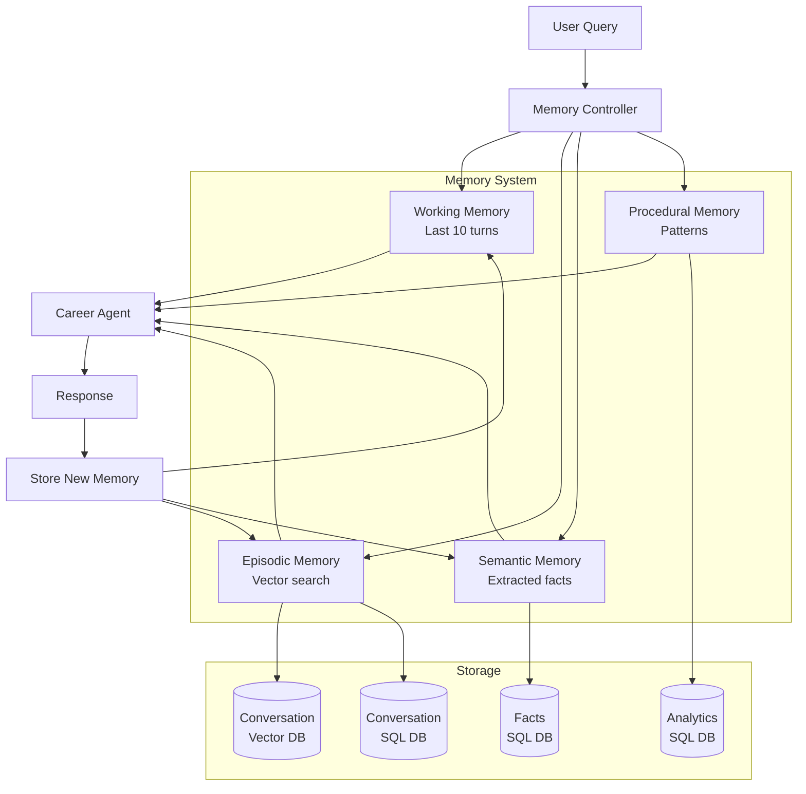

# ADR 003: Memory Management Strategy

**Status:** Proposed  
**Date:** 2025-10-26  
**Deciders:** Development Team  
**Related ADRs:** 
- [ADR 001: Modular Architecture](./001-modular-architecture-with-rag-and-evaluator.md)
- [ADR 002: Technology Stack](./002-technology-stack-selection.md)

## Context and Problem Statement

Agentic systems need effective memory management to:
- **Handle long conversations** without exceeding context windows
- **Maintain relevance** by surfacing pertinent past information
- **Optimize costs** by not sending unnecessary context to LLMs
- **Improve quality** by providing relevant historical context

Without proper memory management:
- ❌ Context windows fill up quickly (DeepSeek: 64K tokens)
- ❌ Costs increase linearly with conversation length
- ❌ Response quality degrades with irrelevant history
- ❌ Latency increases with larger contexts

**Goal:** Implement a multi-layered memory system following context engineering best practices.

## Decision Drivers

- **Context Window Limits**: DeepSeek has 64K token limit
- **Cost Optimization**: Each token costs money ($0.14/M input)
- **Response Quality**: Relevant context improves responses
- **User Experience**: Fast responses, coherent conversations
- **Privacy**: Sensitive data handling
- **Scalability**: Support long-running conversations

## Memory Types in Agentic Systems

### 1. **Working Memory** (Short-term)
Recent conversation turns that are always included

### 2. **Episodic Memory** (Long-term)
Past conversations stored and retrieved semantically

### 3. **Semantic Memory** (Facts)
Extracted facts about the user/domain

### 4. **Procedural Memory** (Patterns)
Learned interaction patterns and preferences

## Considered Options

### Option 1: No Memory Management (Status Quo)
**Approach:** Send entire conversation history every time

**Pros:**
- ✅ Simple implementation
- ✅ No information loss

**Cons:**
- ❌ Hits context limits quickly
- ❌ Expensive (costs scale linearly)
- ❌ Slow (more tokens = more latency)
- ❌ Irrelevant old context dilutes quality

### Option 2: Sliding Window Only
**Approach:** Keep only last N messages

**Pros:**
- ✅ Simple to implement
- ✅ Bounded context size
- ✅ Cost-effective

**Cons:**
- ❌ Loses important earlier context
- ❌ No semantic retrieval
- ❌ Can't reference old conversations

### Option 3: Summarization-Based
**Approach:** Periodically summarize old conversations

**Pros:**
- ✅ Compresses information
- ✅ Maintains key points
- ✅ Bounded context size

**Cons:**
- ❌ Loses details
- ❌ Summarization costs
- ❌ Information loss accumulates

### Option 4: Hybrid Multi-Layer Memory (Chosen)
**Approach:** Combine multiple memory strategies

**Pros:**
- ✅ Best of all approaches
- ✅ Flexible and scalable
- ✅ Maintains relevance
- ✅ Cost-effective

**Cons:**
- ⚠️ More complex implementation
- ⚠️ Requires tuning

## Decision Outcome

**Chosen Option:** Option 4 - Hybrid Multi-Layer Memory System

Implement a four-layer memory architecture:

```
┌─────────────────────────────────────────┐
│         Working Memory (Always)         │
│     Last 5-10 turns in full detail      │
└─────────────────────────────────────────┘
                    ↓
┌─────────────────────────────────────────┐
│      Episodic Memory (Retrieved)        │
│   Semantic search over past convos      │
└─────────────────────────────────────────┘
                    ↓
┌─────────────────────────────────────────┐
│       Semantic Memory (Extracted)       │
│    Key facts about user & preferences   │
└─────────────────────────────────────────┘
                    ↓
┌─────────────────────────────────────────┐
│      Procedural Memory (Learned)        │
│      Interaction patterns & stats       │
└─────────────────────────────────────────┘
```

---

## Detailed Design

### Layer 1: Working Memory (Short-term)

**Purpose:** Maintain immediate conversation context

**Implementation:**
```python
class WorkingMemory:
    """Manages recent conversation history."""
    
    def __init__(self, max_turns: int = 10, max_tokens: int = 4000):
        self.max_turns = max_turns
        self.max_tokens = max_tokens
        self.messages: List[Dict] = []
    
    def add_message(self, role: str, content: str):
        """Add message and maintain window size."""
        self.messages.append({"role": role, "content": content})
        self._trim_if_needed()
    
    def _trim_if_needed(self):
        """Keep only recent messages within limits."""
        # Keep last N turns
        if len(self.messages) > self.max_turns * 2:  # *2 for user+assistant
            self.messages = self.messages[-(self.max_turns * 2):]
        
        # Estimate tokens and trim if needed
        estimated_tokens = sum(len(m["content"]) // 4 for m in self.messages)
        while estimated_tokens > self.max_tokens and len(self.messages) > 2:
            self.messages.pop(0)  # Remove oldest
            estimated_tokens = sum(len(m["content"]) // 4 for m in self.messages)
    
    def get_messages(self) -> List[Dict]:
        """Get current working memory."""
        return self.messages
```

**Configuration:**
- **Default**: Last 10 turns (5 user + 5 assistant)
- **Token limit**: 4,000 tokens (~16K characters)
- **Strategy**: FIFO (First In, First Out)

---

### Layer 2: Episodic Memory (Long-term Retrieval)

**Purpose:** Retrieve relevant past conversations semantically

**Implementation:**
```python
class EpisodicMemory:
    """Semantic search over conversation history."""
    
    def __init__(self, vectorstore: Chroma, db_service: DatabaseService):
        self.vectorstore = vectorstore
        self.db = db_service
    
    def store_conversation(self, user_msg: str, assistant_msg: str, metadata: dict):
        """Store conversation turn for future retrieval."""
        # Combine for better semantic search
        combined_text = f"User: {user_msg}\nAssistant: {assistant_msg}"
        
        # Store in vector DB
        self.vectorstore.add_texts(
            texts=[combined_text],
            metadatas=[{
                "timestamp": metadata.get("timestamp"),
                "user_msg": user_msg,
                "assistant_msg": assistant_msg,
                "evaluation_score": metadata.get("score")
            }]
        )
        
        # Also store in SQL for analytics
        self.db.save_conversation(user_msg, assistant_msg, metadata)
    
    def retrieve_relevant(self, query: str, top_k: int = 3) -> List[Dict]:
        """Retrieve relevant past conversations."""
        results = self.vectorstore.similarity_search(
            query,
            k=top_k,
            filter={"evaluation_score": {"$gte": 7}}  # Only high-quality past responses
        )
        
        return [
            {
                "user": doc.metadata["user_msg"],
                "assistant": doc.metadata["assistant_msg"],
                "relevance_score": doc.metadata.get("score", 0)
            }
            for doc in results
        ]
```

**Configuration:**
- **Top-K**: Retrieve 3 most relevant past conversations
- **Quality filter**: Only retrieve conversations with score ≥ 7
- **Recency bias**: Weight recent conversations higher
- **Deduplication**: Remove near-duplicate retrievals

**Format in Context:**
```
## Relevant Past Conversations:

1. [2 days ago] User asked about Python experience
   You responded: "I have 10+ years of Python experience..."

2. [1 week ago] User asked about leadership roles
   You responded: "I've led teams of 5-15 engineers..."
```

---

### Layer 3: Semantic Memory (Extracted Facts)

**Purpose:** Maintain key facts about the user and conversation

**Implementation:**
```python
class SemanticMemory:
    """Extracted facts and entities."""
    
    def __init__(self, db_service: DatabaseService):
        self.db = db_service
        self.facts: Dict[str, Any] = {}
    
    def extract_facts(self, conversation: List[Dict]) -> Dict[str, Any]:
        """Use LLM to extract key facts from conversation."""
        # Prompt LLM to extract structured facts
        extraction_prompt = """
        Extract key facts from this conversation:
        - User's name
        - User's company/role
        - Specific interests mentioned
        - Questions asked
        - Action items
        
        Return as JSON.
        """
        
        # Call LLM for extraction (using cheap model)
        facts = self._call_llm_for_extraction(conversation, extraction_prompt)
        
        # Store facts
        self.facts.update(facts)
        self.db.save_facts(facts)
        
        return facts
    
    def get_facts_summary(self) -> str:
        """Get formatted summary of known facts."""
        if not self.facts:
            return ""
        
        summary = "## What I know about this user:\n"
        if self.facts.get("name"):
            summary += f"- Name: {self.facts['name']}\n"
        if self.facts.get("company"):
            summary += f"- Company: {self.facts['company']}\n"
        if self.facts.get("interests"):
            summary += f"- Interests: {', '.join(self.facts['interests'])}\n"
        
        return summary
```

**Extracted Information:**
- **User profile**: Name, company, role, location
- **Interests**: Technologies, industries, topics mentioned
- **Preferences**: Communication style, detail level
- **Action items**: Follow-ups, promises made
- **Sentiment**: Overall tone of interaction

**Storage:**
```sql
CREATE TABLE semantic_facts (
    id INTEGER PRIMARY KEY,
    session_id TEXT,
    fact_type TEXT,  -- 'user_profile', 'interest', 'preference', 'action_item'
    fact_key TEXT,
    fact_value TEXT,
    confidence FLOAT,
    extracted_at TIMESTAMP,
    last_updated TIMESTAMP
);
```

---

### Layer 4: Procedural Memory (Interaction Patterns)

**Purpose:** Learn from interaction patterns over time

**Implementation:**
```python
class ProceduralMemory:
    """Learn interaction patterns and preferences."""
    
    def __init__(self, db_service: DatabaseService):
        self.db = db_service
        self.patterns: Dict[str, Any] = {}
    
    def analyze_patterns(self) -> Dict[str, Any]:
        """Analyze conversation patterns from database."""
        analytics = self.db.get_analytics()
        
        patterns = {
            "common_questions": analytics["top_questions"][:5],
            "avg_conversation_length": analytics["avg_turns"],
            "preferred_response_style": self._infer_style(analytics),
            "peak_interaction_times": analytics["interaction_times"],
            "topics_of_interest": analytics["topic_frequency"]
        }
        
        self.patterns = patterns
        return patterns
    
    def get_context_hints(self) -> str:
        """Provide hints to LLM based on learned patterns."""
        if not self.patterns:
            return ""
        
        hints = "## Interaction Patterns:\n"
        
        if self.patterns.get("preferred_response_style"):
            hints += f"- User prefers {self.patterns['preferred_response_style']} responses\n"
        
        if self.patterns.get("common_questions"):
            hints += "- Common questions: " + ", ".join(self.patterns["common_questions"]) + "\n"
        
        return hints
```

**Learned Patterns:**
- **Response length preference**: Detailed vs. concise
- **Technical depth**: High-level vs. technical details
- **Common question types**: Career, technical, personal
- **Interaction frequency**: Daily, weekly, occasional
- **Success metrics**: Which responses led to engagement

---

## Memory Integration Architecture



---

## Memory Controller Implementation

```python
class MemoryController:
    """Orchestrates all memory layers."""
    
    def __init__(
        self,
        working_memory: WorkingMemory,
        episodic_memory: EpisodicMemory,
        semantic_memory: SemanticMemory,
        procedural_memory: ProceduralMemory
    ):
        self.working = working_memory
        self.episodic = episodic_memory
        self.semantic = semantic_memory
        self.procedural = procedural_memory
    
    def build_context(self, user_message: str) -> str:
        """Build complete context from all memory layers."""
        context_parts = []
        
        # 1. Semantic facts (always include if available)
        facts_summary = self.semantic.get_facts_summary()
        if facts_summary:
            context_parts.append(facts_summary)
        
        # 2. Procedural patterns (hints for better responses)
        pattern_hints = self.procedural.get_context_hints()
        if pattern_hints:
            context_parts.append(pattern_hints)
        
        # 3. Episodic memory (retrieve relevant past conversations)
        relevant_past = self.episodic.retrieve_relevant(user_message, top_k=2)
        if relevant_past:
            past_context = "## Relevant Past Conversations:\n"
            for i, conv in enumerate(relevant_past, 1):
                past_context += f"{i}. User: {conv['user']}\n"
                past_context += f"   You: {conv['assistant'][:100]}...\n\n"
            context_parts.append(past_context)
        
        # 4. Working memory (recent turns - handled separately in messages array)
        # This goes directly into the messages array, not in context string
        
        return "\n\n".join(context_parts)
    
    def store_interaction(
        self,
        user_message: str,
        assistant_response: str,
        metadata: dict
    ):
        """Store interaction across all memory layers."""
        # 1. Add to working memory
        self.working.add_message("user", user_message)
        self.working.add_message("assistant", assistant_response)
        
        # 2. Store in episodic memory
        self.episodic.store_conversation(
            user_message,
            assistant_response,
            metadata
        )
        
        # 3. Extract facts periodically (every 5 turns)
        if len(self.working.get_messages()) % 10 == 0:
            recent_conversation = self.working.get_messages()[-10:]
            self.semantic.extract_facts(recent_conversation)
        
        # 4. Update procedural patterns (async/background)
        # This can be done periodically, not on every interaction
```

---

## Context Assembly Strategy

### Priority Order:
1. **System Prompt** (always) - 500-1000 tokens
2. **Semantic Facts** (if available) - 100-300 tokens
3. **Procedural Hints** (if available) - 50-100 tokens
4. **RAG Context** (if relevant) - 500-1000 tokens
5. **Episodic Memory** (if relevant) - 300-500 tokens
6. **Working Memory** (always) - 1000-4000 tokens

### Token Budget:
```
Total Context Budget: 8,000 tokens (leaves 56K for response)

Breakdown:
- System Prompt:        1,000 tokens (fixed)
- Profile (LinkedIn):   2,000 tokens (fixed)
- Semantic Facts:         200 tokens (dynamic)
- Procedural Hints:       100 tokens (dynamic)
- RAG Context:            800 tokens (dynamic)
- Episodic Memory:        400 tokens (dynamic)
- Working Memory:       3,500 tokens (dynamic)
-------------------------------------------
Total:                  8,000 tokens
```

### Overflow Handling:
If context exceeds budget:
1. Trim working memory (keep last 5 turns minimum)
2. Reduce episodic memory (keep top 1 instead of 2)
3. Reduce RAG context (keep top 2 chunks instead of 3)
4. Never trim: System prompt, semantic facts

---

## Configuration

```python
# config/settings.py

class MemorySettings(BaseSettings):
    """Memory management configuration."""
    
    # Working Memory
    working_memory_max_turns: int = 10
    working_memory_max_tokens: int = 4000
    
    # Episodic Memory
    episodic_top_k: int = 2
    episodic_min_score: float = 7.0
    episodic_recency_weight: float = 0.3
    
    # Semantic Memory
    semantic_extraction_frequency: int = 5  # Every N turns
    semantic_extraction_model: str = "deepseek-chat"
    
    # Procedural Memory
    procedural_analysis_frequency: int = 100  # Every N conversations
    
    # Context Budget
    total_context_budget: int = 8000
    system_prompt_budget: int = 1000
    profile_budget: int = 2000
    working_memory_min_turns: int = 5
```

---

## Performance Optimization

### 1. Caching
```python
from functools import lru_cache

@lru_cache(maxsize=100)
def get_semantic_facts(session_id: str) -> Dict:
    """Cache semantic facts to avoid repeated DB queries."""
    return semantic_memory.get_facts(session_id)
```

### 2. Async Operations
```python
async def store_interaction_async(
    user_message: str,
    assistant_response: str
):
    """Store interaction asynchronously to not block response."""
    await asyncio.gather(
        episodic_memory.store_async(user_message, assistant_response),
        semantic_memory.extract_facts_async(user_message, assistant_response)
    )
```

### 3. Batch Processing
- Extract semantic facts in batches (every 5 turns)
- Update procedural patterns in background (every 100 conversations)
- Rebuild vector indices periodically (daily)

---

## Monitoring & Metrics

### Key Metrics:
```python
class MemoryMetrics:
    """Track memory system performance."""
    
    def __init__(self):
        self.metrics = {
            "avg_context_size": [],
            "episodic_retrieval_time": [],
            "semantic_extraction_time": [],
            "cache_hit_rate": 0,
            "memory_usage_mb": 0
        }
    
    def log_context_assembly(self, context_size: int, assembly_time: float):
        """Log context assembly metrics."""
        self.metrics["avg_context_size"].append(context_size)
        # ... log to monitoring system
```

### Alerts:
- Context size > 90% of budget
- Episodic retrieval > 500ms
- Memory usage > 1GB
- Cache hit rate < 70%

---

## Testing Strategy

### Unit Tests:
```python
def test_working_memory_trim():
    """Test working memory maintains size limits."""
    wm = WorkingMemory(max_turns=5)
    for i in range(20):
        wm.add_message("user", f"Message {i}")
    assert len(wm.get_messages()) <= 10  # 5 turns * 2 messages

def test_episodic_retrieval():
    """Test episodic memory retrieves relevant conversations."""
    em = EpisodicMemory(vectorstore, db)
    em.store_conversation("What's your Python experience?", "10+ years...")
    results = em.retrieve_relevant("Tell me about Python")
    assert len(results) > 0
    assert "Python" in results[0]["user"]
```

### Integration Tests:
```python
def test_memory_controller_integration():
    """Test full memory system integration."""
    controller = MemoryController(wm, em, sm, pm)
    
    # Simulate conversation
    for turn in test_conversation:
        context = controller.build_context(turn["user"])
        assert len(context) < 8000  # Within budget
        controller.store_interaction(turn["user"], turn["assistant"], {})
    
    # Verify all layers updated
    assert len(controller.working.get_messages()) > 0
    assert len(controller.semantic.facts) > 0
```

---

## Migration Strategy

### Phase 1: Add Working Memory (Week 1)
- Implement `WorkingMemory` class
- Integrate with existing `ChatbotController`
- No breaking changes

### Phase 2: Add Episodic Memory (Week 2)
- Create separate vector store for conversations
- Implement `EpisodicMemory` class
- Backfill existing conversations

### Phase 3: Add Semantic Memory (Week 3)
- Implement fact extraction
- Create facts database table
- Add to context assembly

### Phase 4: Add Procedural Memory (Week 4)
- Implement pattern analysis
- Add analytics queries
- Integrate hints into prompts

### Phase 5: Optimization (Week 5)
- Add caching
- Implement async operations
- Performance tuning

---

## Positive Consequences

- ✅ **Cost reduction**: 30-50% reduction in token usage
- ✅ **Better responses**: Relevant context improves quality
- ✅ **Scalability**: Handles unlimited conversation length
- ✅ **User experience**: Remembers past interactions
- ✅ **Privacy**: Can implement retention policies per layer

---

## Negative Consequences

- ⚠️ **Complexity**: More moving parts to maintain
- ⚠️ **Storage**: Additional database tables and vector indices
- ⚠️ **Latency**: Retrieval adds ~200ms per request
- ⚠️ **Tuning**: Requires experimentation to optimize

### Mitigations:
- 📚 Comprehensive documentation
- 🧪 Extensive testing
- 📊 Monitoring and alerting
- 🎛️ Configurable parameters

---

## References

### Research Papers:
- [MemGPT: Towards LLMs as Operating Systems](https://arxiv.org/abs/2310.08560)
- [Generative Agents: Interactive Simulacra of Human Behavior](https://arxiv.org/abs/2304.03442)

### Best Practices:
- [LangChain Memory Documentation](https://python.langchain.com/docs/modules/memory/)
- [OpenAI Context Management Guide](https://platform.openai.com/docs/guides/prompt-engineering)
- [Anthropic: Long Context Windows](https://www.anthropic.com/index/100k-context-windows)

### Related ADRs:
- [ADR 001: Modular Architecture](./001-modular-architecture-with-rag-and-evaluator.md)
- [ADR 002: Technology Stack](./002-technology-stack-selection.md)

---

**Last Updated:** 2025-10-26  
**Authors:** Development Team  
**Reviewers:** TBD

