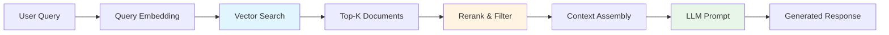

# ADR 004: RAG Design and Context Engineering Strategy

**Status:** Accepted  
**Date:** 2025-10-27  
**Decision Makers:** Development Team  
**Related ADRs:** [001-modular-architecture](001-modular-architecture-with-rag-and-evaluator.md), [002-technology-stack](002-technology-stack-selection.md)

---

## Context

Retrieval-Augmented Generation (RAG) is a critical component of our Career Chatbot, enabling the LLM to access external knowledge beyond its training data. RAG sits at the intersection of information retrieval and context engineering, directly impacting response quality, accuracy, and relevance.

### The Context Engineering Challenge

LLMs have fixed context windows (e.g., DeepSeek: 32K tokens, Gemini: 1M tokens). Effective context engineering requires:

1. **Relevance:** Only include information pertinent to the query
2. **Conciseness:** Maximize signal-to-noise ratio within token limits
3. **Recency:** Prioritize up-to-date information
4. **Diversity:** Avoid redundant or overlapping context
5. **Structure:** Present information in a digestible format

RAG addresses these challenges by dynamically retrieving and injecting relevant context at query time.

---

## Decision

We will implement a **3-stage RAG pipeline** with context engineering best practices:

### Stage 1: Retrieval
- **Vector Database:** Chroma (MVP), with support for LanceDB/PGVector (future)
- **Embedding Model:** `sentence-transformers/all-MiniLM-L6-v2` (384 dimensions, fast)
- **Retrieval Strategy:** Semantic similarity search with top-k results

### Stage 2: Reranking & Filtering
- **Relevance Threshold:** Filter results below similarity score threshold
- **Deduplication:** Remove semantically similar chunks
- **Recency Bias:** Prefer newer documents when available

### Stage 3: Context Assembly
- **Token Budget:** Reserve 25% of context window for RAG results
- **Formatting:** Structured markdown with source attribution
- **Fallback:** Graceful degradation when no relevant results found

---

## RAG in Context Engineering: Overview

### What is RAG?

RAG combines two paradigms:
1. **Retrieval:** Finding relevant documents from a knowledge base
2. **Generation:** Using retrieved context to inform LLM responses



### RAG as Context Engineering

RAG is fundamentally a **context engineering technique** that:

- **Expands effective context:** Access information beyond training data
- **Reduces hallucination:** Ground responses in factual sources
- **Enables personalization:** Retrieve user-specific information
- **Improves accuracy:** Provide domain-specific knowledge
- **Maintains freshness:** Access up-to-date information

---

## RAG Best Practices

### 1. Chunking Strategy

**Challenge:** Balance between context completeness and retrieval precision.

**Best Practices:**
- **Semantic Chunking:** Split by paragraphs, sections, or semantic boundaries
- **Overlap:** 10-20% overlap between chunks to preserve context
- **Size:** 500-1000 tokens per chunk (adjustable based on use case)
- **Metadata:** Include source, timestamp, section headers

**Our Implementation:**
```python
# Simple paragraph-based chunking (MVP)
chunks = [chunk.strip() for chunk in text.split('\n\n') if chunk.strip()]

# Future: Semantic chunking with LangChain
from langchain.text_splitter import RecursiveCharacterTextSplitter
splitter = RecursiveCharacterTextSplitter(
    chunk_size=1000,
    chunk_overlap=200,
    separators=["\n\n", "\n", ". ", " ", ""]
)
```

### 2. Embedding Selection

**Challenge:** Balance between quality, speed, and cost.

| Model | Dimensions | Speed | Quality | Use Case |
|-------|-----------|-------|---------|----------|
| all-MiniLM-L6-v2 | 384 | ⚡⚡⚡ | ⭐⭐⭐ | MVP, fast retrieval |
| all-mpnet-base-v2 | 768 | ⚡⚡ | ⭐⭐⭐⭐ | Production |
| OpenAI text-embedding-3-small | 1536 | ⚡ | ⭐⭐⭐⭐⭐ | High accuracy |
| Gemini text-embedding-004 | 768 | ⚡⚡ | ⭐⭐⭐⭐⭐ | Multimodal |

**Our Choice:** `all-MiniLM-L6-v2` for MVP (fast, good enough, free)

### 3. Retrieval Strategy

**Naive RAG (Our MVP):**
```python
# Simple semantic search
results = vector_db.query(query, top_k=3)
context = "\n\n".join(results)
```

**Advanced RAG (Future):**
```python
# Hybrid search: semantic + keyword
semantic_results = vector_db.query(query, top_k=10)
keyword_results = bm25_search(query, top_k=10)
combined = rerank(semantic_results + keyword_results, query, top_k=3)

# Query expansion
expanded_queries = llm.expand_query(query)
results = [vector_db.query(q, top_k=2) for q in expanded_queries]
```

### 4. Context Assembly

**Best Practices:**
- **Attribution:** Always cite sources
- **Formatting:** Use markdown for readability
- **Token Management:** Monitor and limit context size
- **Relevance Scoring:** Include confidence scores

**Our Implementation:**
```python
def assemble_context(results: List[str], max_tokens: int = 2000) -> str:
    """Assemble RAG context with best practices."""
    if not results:
        return ""
    
    context_parts = ["# Relevant Context\n"]
    token_count = 0
    
    for i, result in enumerate(results, 1):
        chunk_tokens = len(result.split()) * 1.3  # Rough estimate
        if token_count + chunk_tokens > max_tokens:
            break
        
        context_parts.append(f"## Source {i}\n{result}\n")
        token_count += chunk_tokens
    
    return "\n".join(context_parts)
```

### 5. Evaluation Metrics

**Retrieval Quality:**
- **Precision@K:** Relevant results in top-K
- **Recall@K:** Coverage of relevant documents
- **MRR (Mean Reciprocal Rank):** Position of first relevant result
- **NDCG (Normalized Discounted Cumulative Gain):** Ranking quality

**End-to-End Quality:**
- **Answer Relevance:** Does response address the query?
- **Faithfulness:** Is response grounded in retrieved context?
- **Context Utilization:** Is retrieved context actually used?

---

## RAG Challenges & Solutions

### Challenge 1: Irrelevant Retrieval

**Problem:** Retrieved documents don't match user intent.

**Solutions:**
- ✅ **Query Rewriting:** Rephrase ambiguous queries
- ✅ **Relevance Threshold:** Filter low-similarity results
- ✅ **User Feedback:** Learn from implicit/explicit feedback
- ⏭️ **Hybrid Search:** Combine semantic + keyword search

**Our Approach (MVP):**
```python
# Minimum similarity threshold
MIN_SIMILARITY = 0.5

results = vector_db.query(query, top_k=10)
filtered = [r for r in results if r['similarity'] > MIN_SIMILARITY][:3]
```

### Challenge 2: Context Window Overflow

**Problem:** Too much retrieved context exceeds LLM limits.

**Solutions:**
- ✅ **Token Budgeting:** Reserve fixed % for RAG context
- ✅ **Summarization:** Compress long documents
- ✅ **Hierarchical Retrieval:** Retrieve summaries first, then details
- ⏭️ **Adaptive Retrieval:** Adjust top-k based on query complexity

**Our Approach:**
```python
# Reserve 25% of context window for RAG
MAX_CONTEXT_TOKENS = int(settings.max_context_tokens * 0.25)

# DeepSeek: 32K tokens → 8K for RAG
# Gemini: 1M tokens → 250K for RAG (overkill for MVP)
```

### Challenge 3: Stale Information

**Problem:** Knowledge base becomes outdated.

**Solutions:**
- ✅ **Timestamping:** Track document ingestion dates
- ✅ **Incremental Updates:** Add new documents without full reindex
- ⏭️ **Recency Bias:** Weight recent documents higher
- ⏭️ **Automatic Refresh:** Scheduled re-ingestion

**Our Approach:**
```python
# Add metadata with timestamps
rag_service.ingest_text(
    text=content,
    document_id=f"linkedin_{version}",
    metadata={
        "source": "linkedin",
        "timestamp": datetime.now().isoformat(),
        "version": version
    }
)
```

### Challenge 4: Semantic Mismatch

**Problem:** Query and document use different terminology.

**Solutions:**
- ✅ **Query Expansion:** Add synonyms and related terms
- ✅ **Multi-Query:** Generate multiple query variations
- ⏭️ **Fine-tuned Embeddings:** Train on domain-specific data
- ⏭️ **Hybrid Search:** Combine semantic + lexical search

**Future Implementation:**
```python
# Query expansion with LLM
expanded = llm.complete(
    f"Generate 3 alternative phrasings for: {query}"
)
results = [rag_service.search(q) for q in expanded]
```

### Challenge 5: Redundant Results

**Problem:** Multiple similar chunks retrieved.

**Solutions:**
- ✅ **Deduplication:** Remove near-duplicate chunks
- ✅ **Maximal Marginal Relevance (MMR):** Balance relevance + diversity
- ⏭️ **Clustering:** Group similar results, pick representative

**Future Implementation:**
```python
def mmr_rerank(results, query_embedding, lambda_param=0.5):
    """Maximal Marginal Relevance reranking."""
    selected = []
    while len(selected) < top_k:
        best_score = -float('inf')
        best_idx = -1
        
        for i, result in enumerate(results):
            if i in selected:
                continue
            
            # Relevance to query
            relevance = cosine_similarity(query_embedding, result.embedding)
            
            # Diversity from selected
            diversity = min([
                cosine_similarity(result.embedding, selected[j].embedding)
                for j in selected
            ]) if selected else 0
            
            score = lambda_param * relevance - (1 - lambda_param) * diversity
            
            if score > best_score:
                best_score = score
                best_idx = i
        
        selected.append(best_idx)
    
    return [results[i] for i in selected]
```

---

## RAG Evolution: From Naive to Advanced

### Stage 1: Naive RAG (MVP) ✅

**Characteristics:**
- Simple semantic search
- Fixed top-k retrieval
- Direct context injection

**Pros:** Fast, simple, good baseline  
**Cons:** No query understanding, no result filtering

```python
# Naive RAG
results = vector_db.query(query, top_k=3)
context = "\n\n".join(results)
response = llm.complete(f"Context: {context}\n\nQuery: {query}")
```

### Stage 2: Enhanced RAG (Post-MVP) ⏭️

**Enhancements:**
- Query rewriting/expansion
- Relevance filtering
- Reranking with cross-encoder
- Metadata filtering

**Pros:** Better precision, context-aware  
**Cons:** Higher latency, more complex

```python
# Enhanced RAG
rewritten_query = llm.rewrite_query(query)
results = vector_db.query(rewritten_query, top_k=10)
filtered = [r for r in results if r.score > threshold]
reranked = cross_encoder.rerank(filtered, query)[:3]
```

### Stage 3: Agentic RAG (Future) 🚀

**Characteristics:**
- Multi-step reasoning
- Iterative retrieval
- Self-correction
- Tool use for external search

**Pros:** Handles complex queries, adaptive  
**Cons:** High latency, expensive

```python
# Agentic RAG
plan = agent.plan(query)  # Break down complex query
for step in plan:
    results = vector_db.query(step.query, top_k=3)
    if not results:
        results = web_search(step.query)  # Fallback
    step.context = results

response = agent.synthesize(plan)
```

### Stage 4: Graph RAG (Advanced) 🔮

**Characteristics:**
- Knowledge graph construction
- Relationship-aware retrieval
- Multi-hop reasoning
- Entity linking

**Pros:** Rich context, handles complex relationships  
**Cons:** Complex setup, high maintenance

```python
# Graph RAG
entities = extract_entities(query)
subgraph = knowledge_graph.get_subgraph(entities, hops=2)
context = graph_to_text(subgraph)
```

---

## Implementation Strategy

### Phase 1: MVP (Sprint 3) ✅

**Focus:** Simple, working RAG

```python
class RAGService:
    def __init__(self):
        self.client = chromadb.Client()
        self.collection = self.client.get_or_create_collection("career_knowledge")
    
    def ingest_text(self, text: str, doc_id: str):
        chunks = text.split('\n\n')  # Simple chunking
        self.collection.add(documents=chunks, ids=[f"{doc_id}_{i}" for i in range(len(chunks))])
    
    def search(self, query: str, top_k: int = 3) -> List[str]:
        results = self.collection.query(query_texts=[query], n_results=top_k)
        return results['documents'][0] if results else []
```

**Deliverables:**
- ✅ Basic vector search
- ✅ Paragraph-based chunking
- ✅ Top-3 retrieval
- ✅ Simple context injection

### Phase 2: Enhanced (Post-MVP) ⏭️

**Enhancements:**
- Relevance filtering
- Metadata-based filtering
- Better chunking strategy
- Query expansion

### Phase 3: Advanced (Future) 🚀

**Features:**
- Hybrid search
- Reranking
- Adaptive retrieval
- Multi-query

---

## Context Engineering Best Practices Applied

### 1. Token Budget Management

```python
# Allocate context window strategically
CONTEXT_BUDGET = {
    "system_prompt": 0.10,      # 10% - Agent identity & instructions
    "rag_context": 0.25,         # 25% - Retrieved knowledge
    "working_memory": 0.15,      # 15% - Recent conversation
    "user_query": 0.05,          # 5% - Current query
    "response_buffer": 0.45      # 45% - Generation space
}
```

### 2. Context Hierarchy

**Priority Order:**
1. **User Query** (highest priority)
2. **Recent Conversation** (working memory)
3. **Retrieved Context** (RAG)
4. **System Instructions** (agent behavior)

### 3. Context Formatting

```python
def format_rag_context(results: List[str]) -> str:
    """Format RAG results for optimal LLM consumption."""
    return textwrap.dedent(f"""
        # Retrieved Information
        
        The following information was found in the knowledge base:
        
        {chr(10).join(f"- {result}" for result in results)}
        
        Use this information to answer the user's question accurately.
        If the information is insufficient, acknowledge limitations.
    """)
```

### 4. Graceful Degradation

```python
def get_context_with_fallback(query: str) -> str:
    """Retrieve context with fallback strategy."""
    # Try semantic search
    results = rag_service.search(query, top_k=3)
    
    if not results:
        # Fallback: Broader search
        results = rag_service.search(query, top_k=10)
        results = results[:3]  # Take top 3 from broader search
    
    if not results:
        # Final fallback: Return empty with instruction
        return "No specific information found in knowledge base. Provide a general response."
    
    return format_rag_context(results)
```

### 5. Monitoring & Logging

```python
def search_with_telemetry(query: str) -> List[str]:
    """Search with telemetry for monitoring."""
    start_time = time.time()
    results = rag_service.search(query)
    latency = time.time() - start_time
    
    logger.info(
        "RAG search completed",
        extra={
            "query": query,
            "num_results": len(results),
            "latency_ms": latency * 1000,
            "top_score": results[0].score if results else 0
        }
    )
    
    return results
```

---

## Evaluation & Metrics

### Retrieval Metrics

```python
def evaluate_retrieval(test_queries: List[dict]):
    """Evaluate RAG retrieval quality."""
    metrics = {
        "precision_at_3": [],
        "recall_at_3": [],
        "mrr": []
    }
    
    for item in test_queries:
        query = item["query"]
        relevant_docs = set(item["relevant_doc_ids"])
        
        results = rag_service.search(query, top_k=3)
        retrieved_ids = [r.id for r in results]
        
        # Precision@3
        relevant_retrieved = len(set(retrieved_ids) & relevant_docs)
        precision = relevant_retrieved / len(retrieved_ids) if retrieved_ids else 0
        metrics["precision_at_3"].append(precision)
        
        # Recall@3
        recall = relevant_retrieved / len(relevant_docs) if relevant_docs else 0
        metrics["recall_at_3"].append(recall)
        
        # MRR
        for i, doc_id in enumerate(retrieved_ids, 1):
            if doc_id in relevant_docs:
                metrics["mrr"].append(1 / i)
                break
        else:
            metrics["mrr"].append(0)
    
    return {k: sum(v) / len(v) for k, v in metrics.items()}
```

### End-to-End Metrics

- **Answer Relevance:** Evaluator scores (0-10)
- **Context Utilization:** % of retrieved context used in response
- **User Satisfaction:** Implicit feedback (regeneration rate)

---

## Consequences

### Positive

✅ **Grounded Responses:** Reduced hallucination with factual sources  
✅ **Personalization:** Access to user-specific knowledge (LinkedIn, resume)  
✅ **Scalability:** Easy to add new documents without retraining  
✅ **Transparency:** Can cite sources for responses  
✅ **Freshness:** Knowledge base can be updated independently

### Negative

⚠️ **Latency:** Additional retrieval step adds 100-500ms  
⚠️ **Complexity:** More components to maintain (vector DB, embeddings)  
⚠️ **Quality Dependency:** Bad retrieval → bad responses  
⚠️ **Storage:** Vector embeddings require disk space  
⚠️ **Cold Start:** Empty knowledge base provides no value

### Mitigations

- **Latency:** Use fast embedding models, cache frequent queries
- **Complexity:** Modular design, comprehensive tests
- **Quality:** Evaluation metrics, relevance thresholds
- **Storage:** Efficient vector DB (Chroma), compression
- **Cold Start:** Pre-populate with essential documents

---

## Future Enhancements

### Short-term (Post-MVP)
- [ ] Query rewriting with LLM
- [ ] Relevance filtering with threshold
- [ ] Better chunking (semantic boundaries)
- [ ] Metadata filtering (source, date)

### Medium-term
- [ ] Hybrid search (semantic + keyword)
- [ ] Reranking with cross-encoder
- [ ] Multi-query retrieval
- [ ] Adaptive top-k

### Long-term
- [ ] Agentic RAG with multi-step reasoning
- [ ] Graph RAG with knowledge graph
- [ ] Fine-tuned embeddings
- [ ] Real-time knowledge updates

---

## References

### Academic Papers
- **RAG (2020):** Lewis et al., "Retrieval-Augmented Generation for Knowledge-Intensive NLP Tasks"
- **Dense Retrieval (2020):** Karpukhin et al., "Dense Passage Retrieval for Open-Domain Question Answering"
- **ColBERT (2020):** Khattab & Zaharia, "ColBERT: Efficient and Effective Passage Search via Contextualized Late Interaction"

### Industry Resources
- **LangChain RAG Guide:** https://python.langchain.com/docs/use_cases/question_answering/
- **Pinecone RAG Handbook:** https://www.pinecone.io/learn/retrieval-augmented-generation/
- **Weaviate RAG Best Practices:** https://weaviate.io/blog/rag-best-practices

### Related ADRs
- [ADR 001: Modular Architecture](001-modular-architecture-with-rag-and-evaluator.md)
- [ADR 002: Technology Stack](002-technology-stack-selection.md)
- [ADR 003: Memory Management](003-memory-management-strategy.md)

---

**Decision Date:** 2025-10-27  
**Status:** Accepted  
**Next Review:** After Sprint 3 completion

